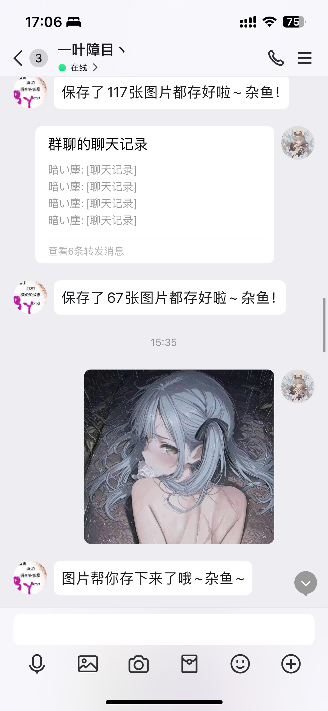

# [仅aiocqhttp]AstrBot 的保存图片插件
首先需要配置在AstrBot安装的宿主机的绝对路径，并保证权限
还需配置NapCat的QQ路径，以保存文件
（docker下需要自行做好映射）
当前限制仅能私聊

> [!TIP]
> 输入保存进入保存模式，之后所有的图片都会帮你保存下来
> 输入不保存退出保存模式

✨嵌套消息图片已支持
✨私聊支持文件

# TODO
- 支持视频（单个视频已支持，嵌套消息视频暂不支持）
- 嵌套消息
